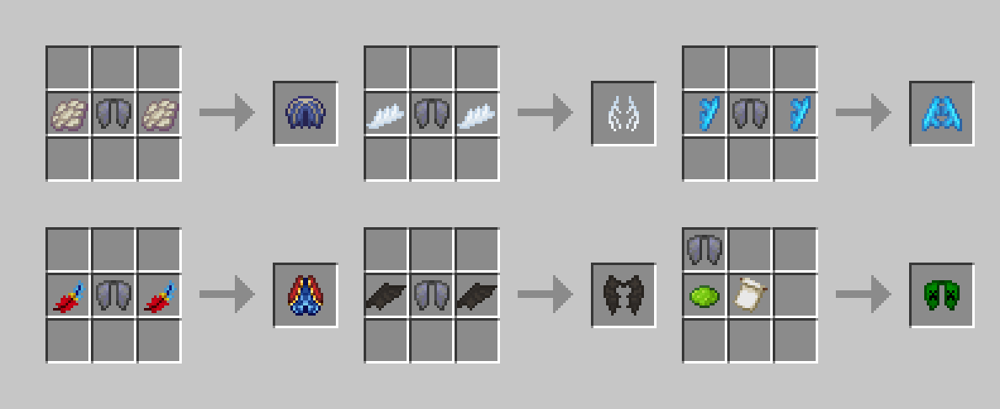
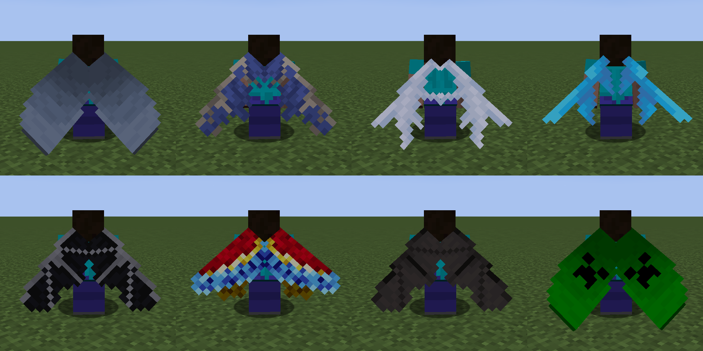

Elytra Skins is a mod that add different skins for elytras.

## Description

All custom elytras can be crafted at a regular crafting table with a normal elytra and some other items.

* Vex wings are dropped by Vexes
* Allay wings can be found inside chests in Pillager Outposts
* The Dragon elytra is crafted with dragon scales and requires [Quark](https://github.com/VazkiiMods/Quark) to be installed
* Parrot feathers are obtained by hitting parrots without holding tools or weapons
* Bat wings are dropped by bats

Different elytra skins don't offer any advantage in durability or flight speed.
The difference is purely cosmetic.

## Credits

Mod Author: [HexagonNico](https://github.com/HexagonNico)

Credits to [vanillatweaks.net](https://vanillatweaks.net) for the Allay, Phantom, Vex, and Dragon elytras.
Terms: [vanillatweaks.net/terms](https://vanillatweaks.net/terms/)

## License

This mod is licensed under Creative Commons Attribution-NonCommercial-NoDerivatives 4.0 International.

* You are free to share, copy and redistribute the material in any medium or format.
* You must give appropriate credit.
* You may not use the material for commercial purposes.
* If you remix, transform, or build upon the material, you may not distribute the modified material.

You are free to use this mod in any modpack, as long as you do not sell it via any means.
